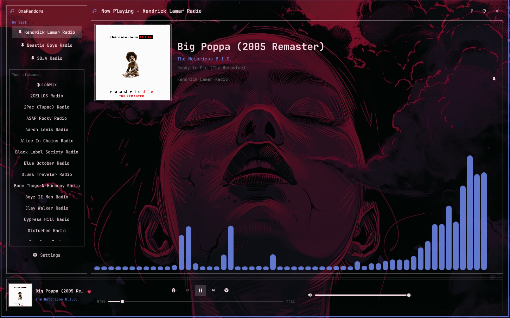

# OmaPandora

**Pandora in Quickshell for [Omarchy](https://omarchy.org) — not a browser tab.**

OmaPandora is a themed bar plugin and floating player. It looks and feels like
[OmaSpotify](https://github.com/jeremylanger/omaspotify), but it plays **Pandora**
through [Pithos](https://github.com/pithos/pithos). Pithos is the login and
playback dependency. OmaPandora is the Omarchy-themed front end.

- Bar icon (music note) opens a large floating player
- Stations, pinned **My list**, Now Playing, and a cava visualizer
- Follows your Omarchy theme
- Keyboard-first: Tab groups, arrow rolodex, Enter to play



Plugin id: `io.github.dankestrick.omapandora`

## Quick start

```bash
# Dependencies
sudo pacman -S --needed pithos cava

# Install the plugin (after this repo is on GitHub)
omarchy plugin add https://github.com/Dankestrick/OmaPandora.git --enable
```

Sign in to Pandora **once** in Pithos. After that, open OmaPandora from the bar.
Pithos runs in the background while you listen and quits when you hit **X**.

Full walkthrough: [docs/install.md](docs/install.md)

## Docs

All guides: [docs/README.md](docs/README.md). Where each source file belongs: [LAYOUT.md](LAYOUT.md).

| Doc | What it covers |
| --- | --- |
| [Install](docs/install.md) | Step by step setup |
| [Uninstall](docs/uninstall.md) | Remove the plugin and optional packages |
| [Dependencies](docs/dependencies.md) | Pithos, cava, and why |
| [First run](docs/first-run.md) | Sign in, play, pin stations |
| [Keyboard](docs/keyboard.md) | Shortcuts |
| [Layout](docs/layout.md) | Bar, sidebar, player |
| [Pithos](docs/pithos.md) | Hidden playback process |
| [Screenshots](docs/screenshots.md) | What to capture and where to put files |
| [Troubleshooting](docs/troubleshooting.md) | Common fixes |
| [Publish](docs/publish.md) | GitHub and marketplace |

License: [MIT](LICENSE)

## Screenshots

The main player is shown above. Add more shots in
[`docs/screenshots/`](docs/screenshots/). Names are listed in
[docs/screenshots.md](docs/screenshots.md).
