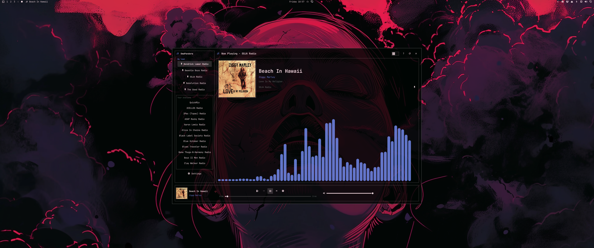
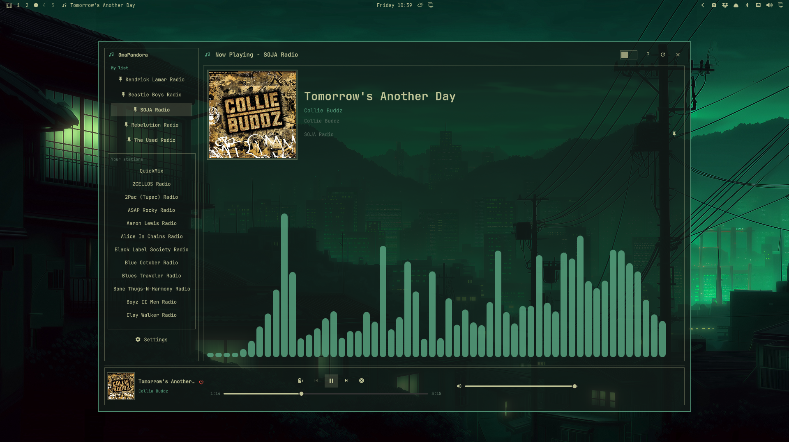
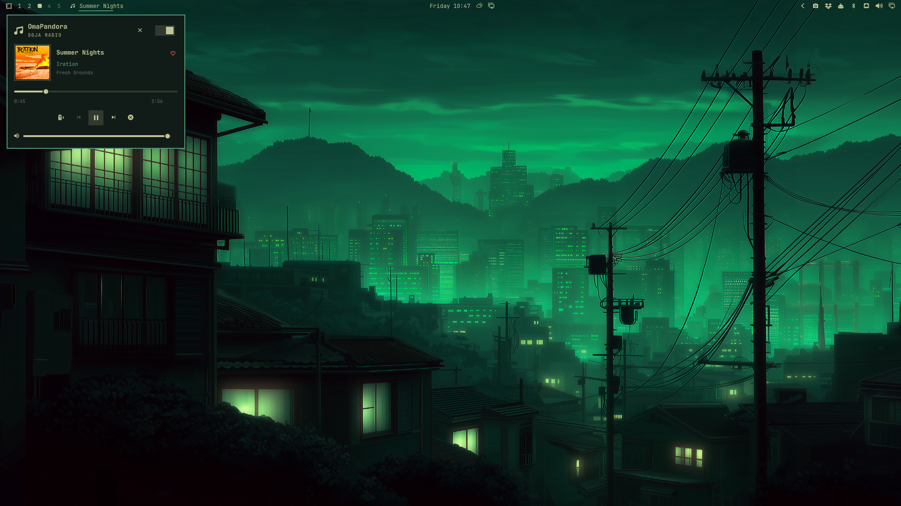
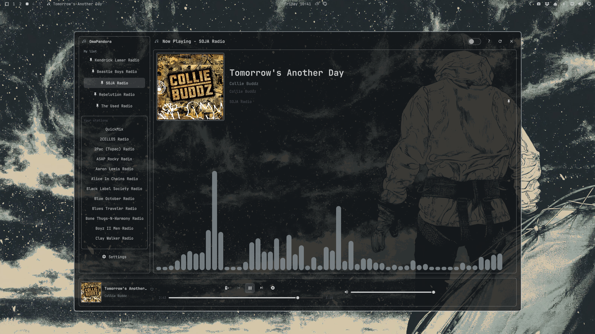
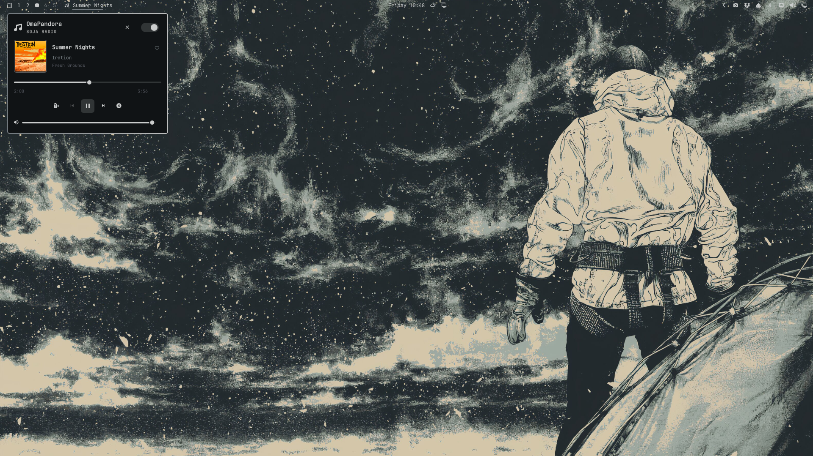
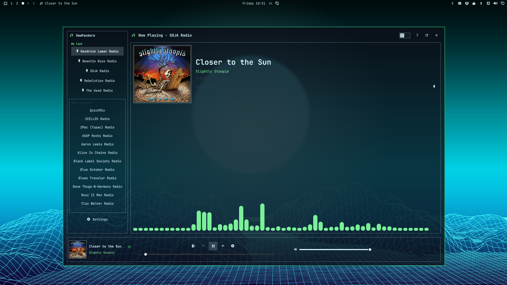
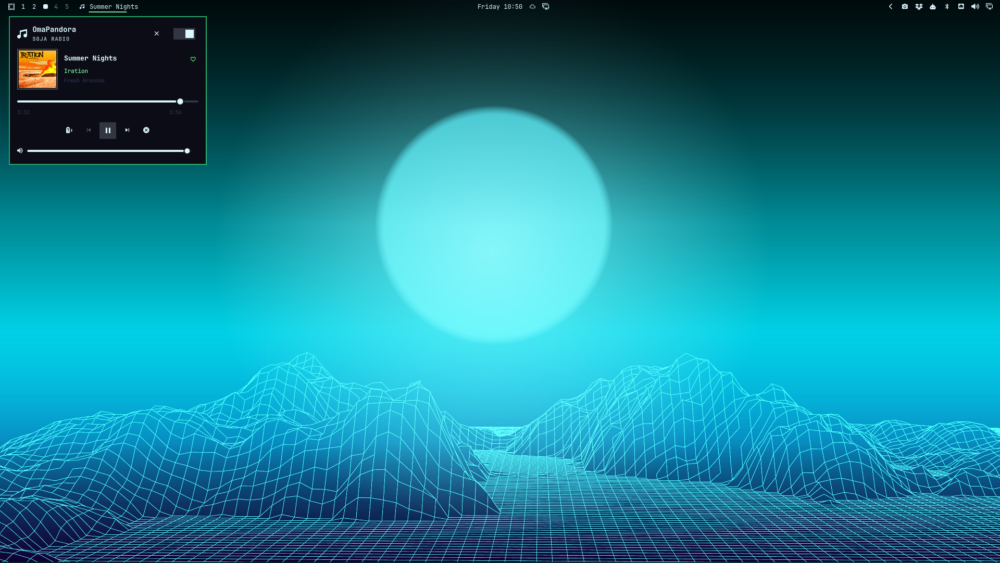
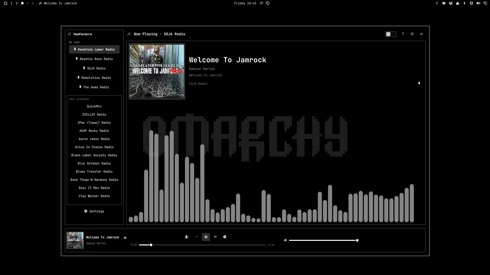
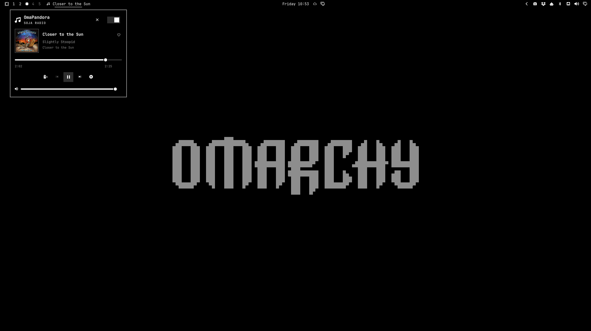

# OmaPandora

**Pandora in the Omarchy bar — not a browser tab.**

OmaPandora is a Quickshell plugin: a music-note on the bar, a mini player, and
a floating window for stations and Now Playing. It follows your Omarchy theme.
Playback goes through [Pithos](https://github.com/pithos/pithos) because
Pandora has no public hobby OAuth for a bar plugin.



Plugin id: `io.github.dankestrick.omapandora`

## Themes

Switch your Omarchy theme and both players follow it. Each row is the same
theme, full player on the left and mini player on the right.

| Full player | Mini player |
| --- | --- |
|  |  |
|  |  |
|  |  |
|  |  |

## Install

You need [Omarchy](https://omarchy.org) 4, a Pandora account, **pithos**, and
**cava** (the Now Playing visualizer).

```bash
sudo pacman -S --needed pithos cava
```

If `pithos` is not in the repos on your snapshot:

```bash
omarchy pkg aur add pithos
```

Then add the plugin:

```bash
omarchy plugin add https://github.com/Dankestrick/OmaPandora.git --enable
```

That clones into `~/.config/omarchy/plugins/io.github.dankestrick.omapandora/`
and places the widget on the **left** of the bar (after workspaces). To move
it:

```bash
omarchy bar move io.github.dankestrick.omapandora --section left
```

Do not symlink this git checkout into the plugins folder. Omarchy rejects a
plugin tree that is a symlink. Full walkthrough: [docs/install.md](docs/install.md).

## First run

1. Click the music-note on the bar.
2. If nothing is connected, open **Pithos** from the plugin (Settings / Open
   Pithos) and sign in with your Pandora account once. The password stays in
   the desktop keyring.
3. After that, control everything from OmaPandora. Pithos stays in the
   background while you listen.

Pithos is not started at login. It starts when you open OmaPandora.

If the Pithos window keeps popping up, add the window rule in
[docs/install.md](docs/install.md#4-optional-window-rules) to keep it out of sight.

## Use

| Action | What happens |
| --- | --- |
| Left-click the bar icon | Toggle the mini player (or the full player if the mini player is turned off) |
| Right-click the bar icon | Open the full player |
| Middle-click the bar icon | Play or pause |
| Scroll down on the bar icon | Next song |
| **X** on the player | Stop the song, quit Pithos, close OmaPandora |
| Bar icon while music is playing | Hide or show the UI; the song keeps going |

The full player opens on the monitor your mouse is on.

The full window has **My list** (pins), **Your stations**, and the big player
(art, cava visualizer, volume). Pandora has no previous-track or seek.

Pinned stations are stored in `~/.config/omarchy/omapandora-pins.json`,
outside the plugin folder, so updates do not wipe them.

## Bar settings

| Setting | Key | Default | What it does |
| --- | --- | --- | --- |
| Open mini-player from bar | `showMiniPlayer` | On | Off makes left-click open the full player |
| Show track title in bar | `showTrackTitle` | On | Song title next to the icon |
| Show artist name in bar | `showArtistName` | Off | Artist next to the title |
| Show paused track in bar | `showPausedTrack` | On | Keep the title up while paused |
| Scroll long bar text | `scrollBarText` | Off | Scroll titles that do not fit |
| Maximum bar text width | `maxBarTextWidth` | 240 | 160 to 560 px, or 0 for unlimited |

Change one from a terminal:

```bash
omarchy bar set io.github.dankestrick.omapandora showArtistName On
```

## Keybinds

OmaPandora answers these commands from anywhere, so you can bind them to keys:

```bash
omarchy-shell io.github.dankestrick.omapandora.player playPause
omarchy-shell io.github.dankestrick.omapandora.player next
omarchy-shell io.github.dankestrick.omapandora.player love              # thumbs up, or undo it
omarchy-shell io.github.dankestrick.omapandora.player toggleMiniPlayer
omarchy-shell io.github.dankestrick.omapandora.player toggleFullPlayer
```

Example for `~/.config/hypr/bindings.lua` (pick any keys that are free):

```lua
o.bind("SUPER + ALT + P", "Pandora play/pause", "omarchy-shell -q io.github.dankestrick.omapandora.player playPause")
o.bind("SUPER + ALT + N", "Pandora next song", "omarchy-shell -q io.github.dankestrick.omapandora.player next")
o.bind("SUPER + ALT + L", "Pandora thumbs up", "omarchy-shell -q io.github.dankestrick.omapandora.player love")
```

## Keyboard

`Ctrl+/` opens the same list inside the player.

| Shortcut | Action |
| --- | --- |
| `Tab` / `F6` | My list → Your stations → big player |
| `↑` / `↓` | Highlight inside the current group (wraps) |
| `Enter` | Play the highlighted station |
| `C` | Pin or unpin |
| `Space` | Play or pause |
| `Ctrl+Right` | Next song |
| `Ctrl+Up` / `Ctrl+Down` | Volume |
| `M` | Mute |
| `/` or `Ctrl+F` | Search stations |
| `Ctrl+/` | Shortcut list |
| `Esc` | Close the window (music keeps going unless you use **X**) |

## Troubleshooting

Something not working? See [docs/troubleshooting.md](docs/troubleshooting.md).

## Remove

```bash
omarchy plugin remove io.github.dankestrick.omapandora --yes
```

That removes the plugin files and the bar widget. It does **not** uninstall
pithos or cava, and it does **not** delete your pins.

```bash
rm -f ~/.config/omarchy/omapandora-pins.json   # optional
pkill -x pithos                                 # if it is still running
sudo pacman -Rns pithos cava                    # only if nothing else needs them
```

From a git checkout you can also run `./scripts/uninstall.sh`, which calls
the same `omarchy plugin remove`. Details: [docs/uninstall.md](docs/uninstall.md).

## Develop from a clone

`scripts/install.sh` copies `manifest.json`, `qml/`, and `helpers/` into the
live plugin directory. Use it while hacking, not as the public install.

```bash
git clone https://github.com/Dankestrick/OmaPandora.git
cd OmaPandora
./scripts/install.sh
omarchy restart shell
./scripts/validate.sh
```

Where new files belong: [LAYOUT.md](LAYOUT.md). More guides: [docs/README.md](docs/README.md).

## License

[MIT](LICENSE) © 2026 Dankestrick
